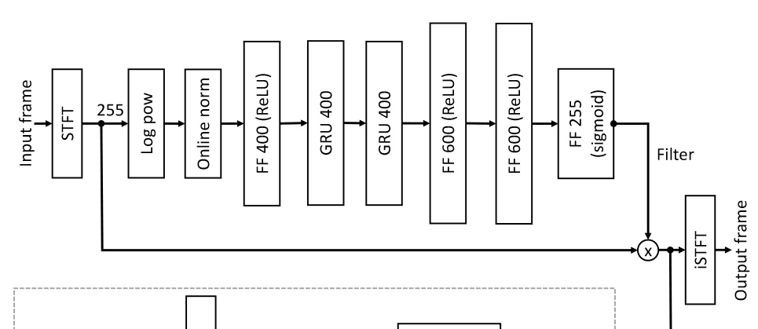

# pytorch models for speech enhancement

> 模型的复杂度排序（大部分跟性能成正比）：NsNet < DCRN < DPCRN < DCCRN < MTFAA

> 不一定非得全部转换 （有限NsNet和DPCRN）。我们确定了NsNet和DPCRN能转换成功后可以上一些最近比较好的模型，这两个模型里面的操作基本还算比较全了

## 数据集

    http://cloud.189.cn/t/UbaiianMBRri（访问码：xt6a）

    里面有5s_100h.tar.gz和5s_500h.tar.gz，分别对应了100小时的数据和500小时的。

    test_set是DNSChallenge的开放测试集

    我正在上传DNS2020的原始数据集（干净语音和噪声），后续可以用这些和各自的数据集去制作更多的数据去训练。

## 代码仓库介绍

* scripts

    我把每个模型的训练、单样本测试和DNS测试集测试的脚本都放这里了。

* base
    
    这里面放了一些基础的类，dataloader等

* utils

    一些工具代码

* loss

    一些常用的损失函数，最常用的是sisnr

* 其他文件夹

    各个模型被放到了以其名称命名的文件夹

* train.py

    训练的入口

* denoisy_test.py

    可以进行单个样本的测试

* eval_on_dns.py

    在dns公开测试集上测试的代码

## 模型介绍

* ### NsNet

    https://arxiv.org/pdf/2008.06412

    微软DNSChallenge的baseline
    > 训练脚本在   pytorch_refer_models/scripts/nsnet.sh 
    
    * 模型的结构

        

        介绍：这个模型只对幅度谱做了处理，所以可以看到它的相位谱是直接延用的原始的noisy。模型比较简单。
    
    * 测试

        我这里在100小时的数据上训练且测试了，结果我放到exp/nsnet里了。

* ### DCRN

    比较常用的一个复数谱CRN的baseline

    http://web.cse.ohio-state.edu/~wang.77/papers/Tan-Wang.icassp19.pdf

* ### DCCRN

    2020年DNS-Challenge冠军
    
    https://arxiv.org/pdf/2008.00264

* ### DPCRN

    好像是2021年DNS-Challenge的第三，比DCCRN简单

    https://arxiv.org/pdf/2107.05429.pdf

* ### MTFAA

    2022年DNS-Challenge冠军

    https://ieeexplore.ieee.org/abstract/document/9746610
